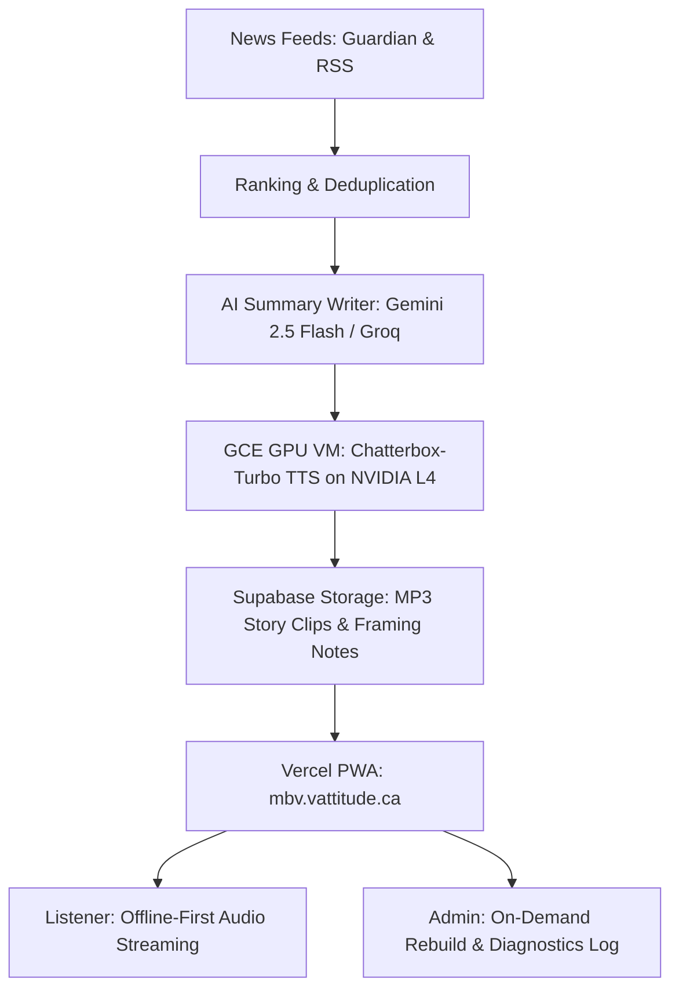

# Morning Brief — Google Gemini AI Studio Integration & Architecture Guide

This guide details the complete architecture of **Morning Brief**, how to connect it directly to **Google Gemini AI Studio**, the exact system prompts and structured JSON schemas to use in AI Studio, and how the error diagnostics pipeline works.

---

## 1. System Architecture Overview



### The Three Core Layers:
1. **The Intelligence Layer (Text Summarization)**:
   - Evaluates and ranks news from top categories (Top Stories, AI, Tech, Politics, Entertainment, Science, Sports).
   - Generates spoken radio-style "beats" (cadenced lines with natural pauses) and written card summaries.
   - Powered by **Google Gemini AI Studio** (`gemini-2.5-flash`, `gemini-1.5-flash`) or Groq.
2. **The Voice Engine (Audio Synthesis)**:
   - Runs **Chatterbox-Turbo** on Google Compute Engine (`g2-standard-4` with 1x NVIDIA L4 GPU, 24 GB VRAM).
   - Synthesizes 35 stories + 11 framing voice notes into high-quality 24kHz MP3 audio in ~6.5 minutes per narrator.
   - Uploads clips and metadata directly to Supabase (`briefings` storage bucket and `story_audio` table).
3. **The Web & PWA Client (`mbv.vattitude.ca`)**:
   - Zero-overhead Vanilla JavaScript and CSS with rich glassmorphism.
   - Continuous audio player with chapter skipping, background playback, and PWA standalone offline caching.
   - Admin control panel with on-demand audio generation and runtime diagnostics.

---

## 2. Connecting Google Gemini AI Studio

Morning Brief now has built-in native support for **Google Gemini AI Studio**.

### Step 1: Get your API Key
1. Open [Google AI Studio](https://aistudio.google.com/).
2. Click **Get API key** in the top navigation.
3. Create a key and copy it.

### Step 2: Add to `.env`
Add your key to `.env`:
```bash
GEMINI_API_KEY=AIzaSy...your_gemini_key_here
GEMINI_MODELS=gemini-2.5-flash,gemini-1.5-flash
```

### How the Pipeline Uses Gemini
When `GEMINI_API_KEY` is present, `app/writer.py` automatically routes summary generation to Google Gemini using the high-performance `gemini-2.5-flash` model via Google's OpenAI-compatible endpoint:
`https://generativelanguage.googleapis.com/v1beta/openai/chat/completions`

If Gemini hits a temporary rate limit, it automatically falls back to secondary models or Groq, ensuring briefings always finish on time.

---

## 3. Gemini AI Studio Prompt Specification

You can experiment with this exact system prompt and schema directly in the **Google AI Studio Prompt Playground**:

### Model Configuration
- **Model**: `gemini-2.5-flash` (or `gemini-1.5-pro` for deep editorial analysis)
- **Temperature**: `0.35`
- **Top P**: `0.95`
- **Output Format**: Structured JSON

### System Prompt
```text
You write copy for a warm, trustworthy morning audio news briefing for listeners in Canada.
The spoken text is read aloud by a text-to-speech voice, so it is written for the ear; the summary appears on a news card.

Return a JSON object with exactly these keys:
- "headline": a clear, neutral headline of at most 12 words.
- "summary": the card text, 40 to 60 words of plain factual prose built only from the supplied text.
- "spoken": what the host says, as an array of 2 to 4 beats, 45 to 85 words in all. The app leaves a short pause between beats, so each beat is one idea in one or two sentences. The first beat is the news itself, who did what, in one sentence; then the key detail; then why it matters or what happens next.

How the spoken beats should sound:
- Like a calm radio host talking to one listener: plain words, contractions, active voice.
- Sentences of 8 to 20 words, with the subject and verb near the start. No long lead-in clauses.
- Attribution after the fact, not before it: "The plant will close in March, the company said."
- Commas only where a speaker would breathe. No semicolons, colons, dashes, brackets or quotation marks; paraphrase quotes instead.
- Numbers the way people say them: rounded, at most two in a sentence, written as digits with "percent" and "dollars" in words (55 percent, 64 million dollars, 11 a.m.).
- Use a person's full name and role the first time, then the surname. Expand initials a listener might not know.
- Never name the news outlet or say "reports" or "according to" about it: the app credits the source separately. Start with the news itself, not a greeting or a transition: the app adds those.
- No URLs, emoji, lists or markdown.

Stay strictly factual and neutral. Never add facts that aren't in the text; if the text is thin, say less.
```

### JSON Response Schema
```json
{
  "type": "object",
  "properties": {
    "headline": {
      "type": "string",
      "description": "Clear headline of up to 12 words."
    },
    "summary": {
      "type": "string",
      "description": "40 to 60 words for the visual news card."
    },
    "spoken": {
      "type": "array",
      "items": { "type": "string" },
      "description": "2 to 4 spoken beats, 45 to 85 words in all."
    }
  },
  "required": ["headline", "summary", "spoken"]
}
```

---

## 4. Graceful Error Handling & Admin Diagnostics

### Problem Solved
Previously, unexpected database or network errors triggered an abrasive red popup banner (`.toast.error` in solid `#B3261E`) displaying raw SQL/API stack traces directly to end users.

### New Solution:
1. **User-Facing Error Sanitization**:
   - Technical errors are intercepted by `sanitizeError()`.
   - Normal listeners only see calm, polite notifications (e.g. *"Offline mode active. Showing your saved briefing."* or *"System synchronization in progress. Please retry."*).
2. **Redesigned Floating Toast**:
   - A modern floating pill with frosted dark obsidian glass (`backdrop-filter: blur(28px)`), rounded pill geometry, and soft glowing status indicators.
   - Smooth spring-based enter/exit animations.
3. **Admin Diagnostics & Error Log**:
   - Every raw exception, network glitch, and stack trace is recorded to `store.get('diagnostics-log')`.
   - On the **Admin Page** (`mbv.vattitude.ca/admin`), admins have a dedicated **System Diagnostics & Error Log** section:
     - View chronological client exceptions and background job issues.
     - Expandable stack traces.
     - **Copy Diagnostics** button to instantly grab debug JSON (ready to paste into Gemini for diagnosis).
     - **Clear Error Log** button.
