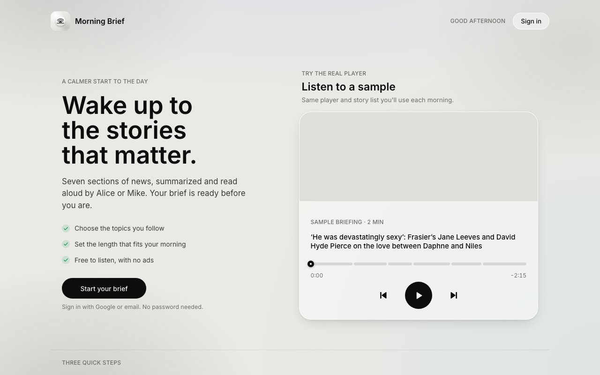
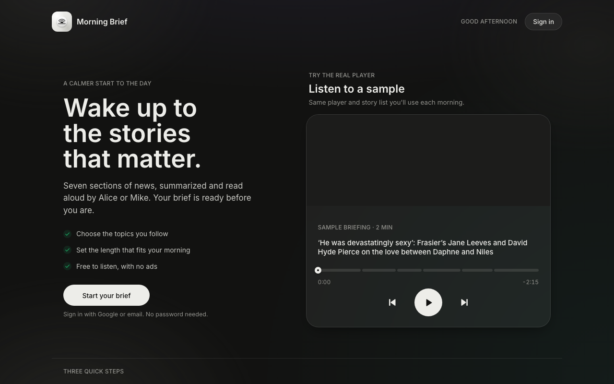

# ☀️ Morning Brief

**Your daily news, read aloud anytime.**  
A 5-minute audio briefing from The Guardian's top stories, voiced by 4 neural personas: **C-3PO**, **Jerry**, **Alice**, and **Mike**.  
No ads. No tracking. Zero doom-scrolling.

[**Web PWA**](#-web-pwa) · [**Android App**](#-android-app) · [**Features**](#-features) · [**Changelog**](CHANGELOG.md) · [**Technical Guide**](docs/TECHNICAL.md)

---

## ☕ Features

* **4 Neural Narrators**: Switch between 4 distinct voice models with 1 tap:
  * **C-3PO** — Polite British protocol droid.
  * **Jerry** — Observational wit.
  * **Alice** — Warm British newsreader.
  * **Mike** — Crisp American morning news.
* **Time-Adaptive Audio**: Adapts greetings (`Good morning`, `Good afternoon`, `Good evening`) to your local time.
* **5-Minute Format**: 12–16 stories across 7 Guardian editorial sections (Top Stories, AI, Tech, Politics, Entertainment, Science, Sports), extracted and summarized for listening.
* **Interactive Follow-Along**: Story cards highlight and auto-scroll as audio plays. Tap any story card to seek directly to it.
* **Custom Category Ordering**: Drag and reorder topics to prioritize the sections you care about first.
* **No Ads or Tracking**: No sponsored content, tracking pixels, or algorithmic feeds.

---

## 🖥️ Web PWA

Works in any modern browser on desktop, tablet, and mobile with light and dark themes.

### Light Mode

### Dark Mode

Install as a Progressive Web App (PWA) on Chrome, Edge, or Safari for offline caching and web push notifications.

---

## 📱 Android App

Native Android app with Jetpack Compose, Media3 background audio, and lock-screen controls.

| Today's Briefing | Follow-Along Audio | Topics & Sources | Settings & Voices |
| :---: | :---: | :---: | :---: |
|  |  |  |  |

- **Background Audio**: Android Media3 notification and lock-screen playback controls.
- **Narrator Switcher**: Instant switching between C-3PO, Jerry, Alice, and Mike.
- **Custom Category Sorting**: Reorder news categories to listen in your preferred sequence.
- **Device & Cloud Playback**: Stream cloud-voiced editions or run on-device audio offline.

---

## 🚀 Getting Started

### Web
1. Open the [Morning Brief web app](web/).
2. Click **Play** on today’s edition—no account required.
3. Sign in with Google or magic link to sync preferences across devices.

### Android
1. Download the APK from [GitHub Releases](https://github.com/vattitude-me/morning-brief-voice/releases).
2. Install on Android 10+.
3. Pick your preferred narrator and topic order.

---

## 🛠️ Developer Documentation

- [**Technical & Architecture Guide (`docs/TECHNICAL.md`)**](docs/TECHNICAL.md) — Architecture diagrams, Supabase schema, Cloud Run jobs, and GCE GPU automation.
- [**Android App Guide (`android/README.md`)**](android/README.md) — Gradle build steps, Compose architecture, and release signing.
- [**Voice Service Guide (`voice_service/README.md`)**](voice_service/README.md) — Chatterbox-Turbo TTS service, FastAPI endpoints, GPU acceleration, and voice reference clips.
- [**Changelog (`CHANGELOG.md`)**](CHANGELOG.md) — Version history and release notes.

---

Free · Open Source · No ads · No tracking

