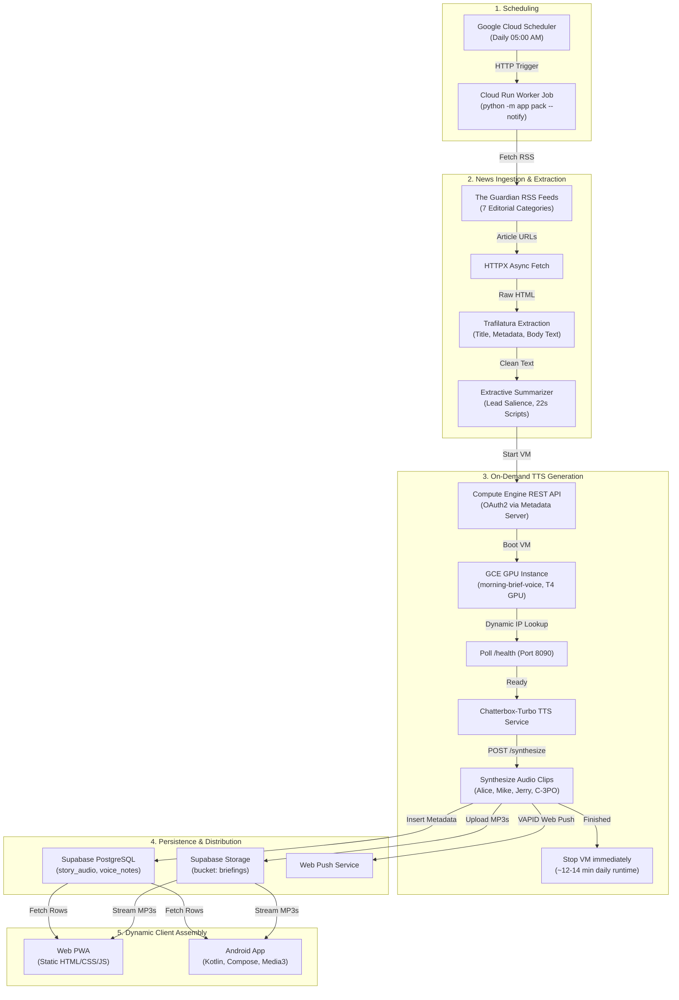

# Morning Brief — Technical & Architecture Guide

Morning Brief is an automated news briefing system that compiles, summarizes, and voices daily news into a 5-minute audio briefing. Audio is rendered once per day on a dedicated GPU instance and assembled dynamically by web and Android clients based on user topic preferences and custom ordering.

---

## Architecture Flow

The system runs a daily batch ingestion and synthesis pipeline triggered by Google Cloud Scheduler, writes shared audio clips to Supabase, and serves them to client applications.



---

## 1. News Ingestion & Article Extraction

### The Guardian Single-Source Architecture
The system ingests stories across 7 fixed categories defined in [`app/guardian.py`](file:///Users/vattitude/Coding/Morning_Brief/app/guardian.py):
- `top` — Top stories (`international/rss`)
- `ai` — Artificial Intelligence (`technology/artificialintelligenceai/rss`)
- `tech` — Technology (`uk/technology/rss`)
- `politics` — Politics (`politics/rss`)
- `entertainment` — Culture & Entertainment (`culture/rss`)
- `science` — Science (`science/rss`)
- `sports` — Sport (`uk/sport/rss`)

The RSS order represents editorial curation, avoiding ranking models. The worker takes the top 5 articles per section (with a 5-article deduplication margin) and discards articles older than 48 hours.

### Parsing with Trafilatura
In [`app/fetcher.py`](file:///Users/vattitude/Coding/Morning_Brief/app/fetcher.py), `trafilatura` extracts clean article text, metadata, and hero images from raw HTML while discarding boilerplate, navigation menus, inline ads, and comments:

```python
def extract_article(page_html: str, url: str) -> dict:
    raw = trafilatura.extract(
        page_html,
        url=url,
        output_format="json",
        with_metadata=True,
        include_comments=False,
        include_tables=False,
        favor_precision=True,
    )
    if not raw:
        meta = trafilatura.extract_metadata(page_html, default_url=url)
        return {
            "title": getattr(meta, "title", None),
            "description": getattr(meta, "description", None),
            "image": getattr(meta, "image", None),
            "sitename": getattr(meta, "sitename", None),
            "text": "",
        }
    data = json.loads(raw)
    return {
        "title": data.get("title"),
        "description": data.get("description") or data.get("excerpt"),
        "image": data.get("image"),
        "sitename": data.get("sitename") or data.get("hostname"),
        "date": data.get("date"),
        "text": data.get("text") or data.get("raw_text") or "",
    }
```

### Extractive Summarization
Rather than using generative LLMs that risk hallucination and impose per-call API billing, [`app/summarizer.py`](file:///Users/vattitude/Coding/Morning_Brief/app/summarizer.py) generates spoken broadcast scripts algorithmically:
1. Strips datelines, author credits, and photo captions.
2. Identifies key informational sentences using lead paragraph proximity and term frequency.
3. Produces a 2-to-3 sentence script calibrated to ~22 seconds of spoken speech.

---

## 2. On-Demand TTS & GCE GPU Lifecycle

Neural audio synthesis requires an NVIDIA GPU (running Chatterbox-Turbo / PyTorch). To prevent the high cost of a 24/7 GPU VM (~$500/month), [`app/gce.py`](file:///Users/vattitude/Coding/Morning_Brief/app/gce.py) manages the instance lifecycle dynamically via Compute Engine REST APIs:

```text
Run cost comparison:
- 24/7 GCE T4 GPU:            ~$500.00 / month
- 1-hour static daily cron:    ~$21.00 / month
- Dynamic on-demand lifecycle:   ~$4.50 / month (~$0.15 / day for ~12-14 min runtime)
```

### Dynamic VM Session Flow
[`app/gce.py:voice_vm_session`](file:///Users/vattitude/Coding/Morning_Brief/app/gce.py#L104-L180) handles authentication, boot, IP resolution, and shutdown in a Python context manager:

1. **Authentication**: Requests an OAuth2 access token via Google Cloud internal metadata server (`http://metadata.google.internal/computeMetadata/v1/instance/service-accounts/default/token`) in Cloud Run, or falls back to `gcloud auth print-access-token` locally.
2. **Dynamic IP Resolution**: Queries `https://compute.googleapis.com/compute/v1/projects/{project}/zones/{zone}/instances/{instance}` to read the instance's current external NAT IP. This eliminates hardcoded IP addresses.
3. **Instance Start**: Calls the GCE start endpoint if the instance is not already running.
4. **Health Check**: Polls `GET http://<VM_IP>:8090/health` until the FastAPI service responds with `{"status": "ok"}`.
5. **Synthesis**: Synthesizes the day's stories and voice framing notes across all 4 narrators.
6. **Automatic Teardown**: An outer `finally` block unconditionally calls the GCE stop endpoint once audio generation completes (or on error).

### Voice Service API Contracts
The TTS service in [`voice_service/`](file:///Users/vattitude/Coding/Morning_Brief/voice_service) exposes three primary endpoints on port `8090`:

#### `GET /health`
Returns service status, active device (`cuda`, `mps`, or `cpu`), and audio sample rate.
```json
{
  "status": "ok",
  "device": "cuda",
  "sample_rate": 24000
}
```

#### `GET /voices`
Lists available voice reference clips bundled in `voice_service/data/voices/`:
- `c3po_reference` — C-3PO (Polite protocol droid)
- `jerry_reference` — Jerry (Observational wit)
- `her_reference` — Alice (Warm British broadcast)
- `him_reference` — Mike (Crisp American morning news)

#### `POST /synthesize?format=mp3`
Accepts text and voice identifier, returning synthesized audio bytes along with an `X-Duration` header indicating clip length in seconds:
```http
POST /synthesize?format=mp3 HTTP/1.1
Content-Type: application/json

{
  "text": "Good morning. In artificial intelligence news today, researchers announced...",
  "voice": "c3po_reference"
}
```
Response:
```http
HTTP/1.1 200 OK
Content-Type: audio/mpeg
X-Duration: 21.84

<binary audio bytes>
```

---

## 3. Storage & Client Assembly

### Supabase Storage & Database Schema
Synthesized audio files are stored in Supabase Storage under `briefings/{date}/{voice}/` and tracked in PostgreSQL:

- **`story_audio`**: Individual story clips.
  - Columns: `date`, `section`, `rank`, `title`, `script`, `url`, `source`, `image`, `audio_path`, `duration`, `voice`.
- **`voice_notes`**: Spoken framing audio clips per voice.
  - `note_key`: `greeting_morning`, `greeting_afternoon`, `greeting_evening`, `intro_{section}`, `outro`, `pack_ready`.
- **`profiles`**: User settings stored as JSONB (`stories`, `section_order`, `voice`, `speed`, `daily`, `color_photos`).

### Client Assembly Engine (`StoryPack`)
Audio clips are synthesized once for all listeners. The web PWA ([`web/js/storypack.js`](file:///Users/vattitude/Coding/Morning_Brief/web/js/storypack.js)) and Android app ([`StoryPack.kt`](file:///Users/vattitude/Coding/Morning_Brief/android/app/src/main/java/me/vattitude/morningbrief/data/StoryPack.kt)) assemble custom briefings client-side without re-encoding:

1. **Verify Readiness**: Checks that `voice_notes` contains a `pack_ready` record for the requested voice and date.
2. **Greeting Selection**: Selects `greeting_morning` (< 12:00), `greeting_afternoon` (12:00–17:00), or `greeting_evening` (>= 17:00) according to the user's local clock.
3. **Category Ordering**: Loops through `section_order` (falling back to default: `top`, `ai`, `tech`, `politics`, `entertainment`, `science`, `sports`).
4. **Story Counts**: Selects the top $N$ stories configured for each category in the user's settings.
5. **Breaths**: Inserts a 0.8-second silent pause (`BREATH = 0.8`) between consecutive clips to ensure natural speech cadence.
6. **Sign-off**: Plays the narrator's `outro` clip at the end.

---

## 4. Environment Configuration

| Variable | Example Value | Description |
| :--- | :--- | :--- |
| `SUPABASE_URL` | `https://xyz.supabase.co` | Supabase API endpoint |
| `SUPABASE_SECRET_KEY` | `ey...` | Service-role key for backend worker write operations |
| `VOICE_SERVICE_URL` | `http://34.67.158.112:8090` | Primary voice service endpoint (or `auto` for dynamic IP) |
| `GCP_PROJECT` | `project-67937e0a-4d2d-43ea-9ba` | Google Cloud project ID |
| `GCE_ZONE` | `us-central1-c` | Zone containing the GPU VM |
| `GCE_INSTANCE` | `morning-brief-voice` | Compute Engine VM instance name |
| `GCE_MANAGE_VM` | `true` | Enables automatic VM boot, dynamic IP resolution, and shutdown |
| `STORY_VOICES` | `her_reference,him_reference,jerry_reference,c3po_reference` | Comma-separated voices to render during daily batch |
| `BRIEFING_TIMEZONE` | `America/Toronto` | Primary timezone for schedule calculations |
| `VAPID_PRIVATE_KEY` | `...` | Key for Web Push delivery |
| `VAPID_PUBLIC_KEY` | `...` | Public key distributed to clients for push subscription |

---

## 5. Operations & CLI Commands

### Run Story Pack Generation Locally
```bash
# Build daily pack for all configured voices
python3 -m app pack

# Build for a specific voice and date
python3 -m app pack --date 2026-10-10 --voice c3po_reference

# Verify environment and database connections
python3 -m app check
```

### Trigger Batch with On-Demand GPU VM
```bash
./scripts/daily_pack_run.sh
```

### Deploy Cloud Run Scheduled Job
```bash
# Deploys container image and schedules Cloud Run Job for 05:00 AM daily
./scripts/setup-scheduler.sh project-67937e0a-4d2d-43ea-9ba us-central1
```

### Sync Custom Voice Reference Audio to GCE VM
```bash
./scripts/sync-voices-to-gce.sh
```

---

## 6. Testing

### Python Backend Unit Tests
```bash
pytest -q
```

### Android Unit Tests
```bash
cd android
JAVA_HOME=/opt/homebrew/opt/openjdk@21/libexec/openjdk.jdk/Contents/Home ./gradlew testDebugUnitTest
```
